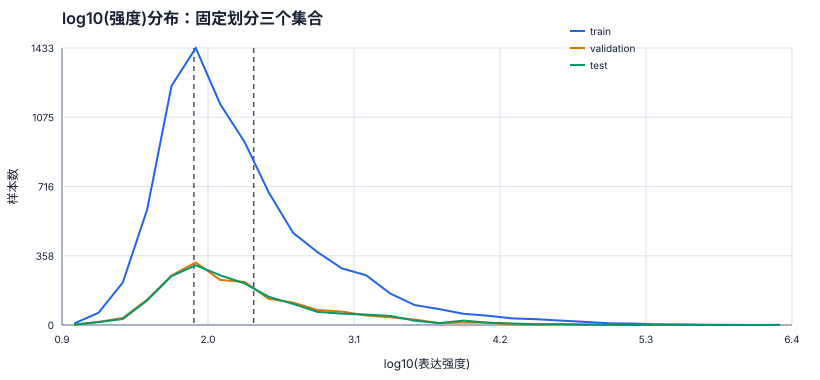
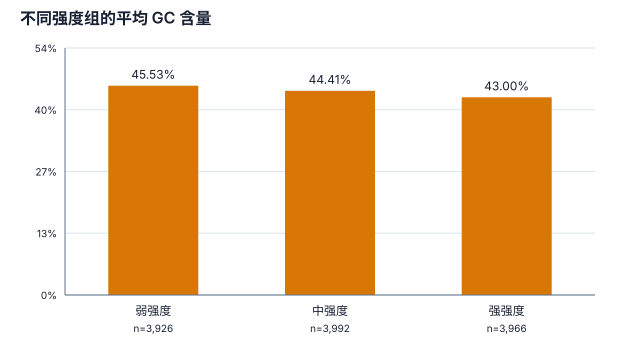
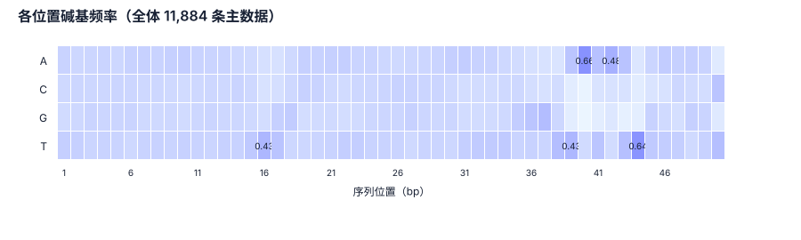

# M2 正式 EDA：大肠杆菌连续强度主数据

分析对象为 11,884 条、长度均为 50 bp 的大肠杆菌启动子序列。所有统计基于版本化的 90% 相似性聚类划分；强度分档边界仅根据训练集计算。

## 1 数据字典

| 字段 | 含义 | 处理方式 |
|---|---|---|
| `sample_index` | 原始 NPY 数组中的行号 | 用于固定划分和复现 |
| `sequence` | 50 bp DNA 启动子序列 | 大写，仅包含 A/T/C/G |
| `strength` | 原始连续表达强度 | 正数，范围跨度大 |
| `log10_strength` | `log10(strength)` | 预测和生成的连续条件 |
| `split` | train / validation / test | 以相似性簇为单位固定 |

## 2 质量与划分检查

- 样本数：11,884；序列长度：全部 50 bp；完全重复：0；非法 DNA 字符：0。
- 固定划分：训练集 8,318 条，验证集 1,783 条，测试集 1,783 条。
- 训练集 `log10(强度)` 分档边界：1.9323、2.3830。
- 近重复保护：90% 相似性连通簇不会跨集合；详细簇统计见 `../m2_split_and_strength_baseline_2026-09-17.md`。

| 集合 | 样本数 | log10 强度均值 ± 标准差 | GC 均值 ± 标准差 |
|---|---:|---:|---:|
| train | 8,318 | 2.2819 ± 0.6366 | 44.22% ± 8.63% |
| validation | 1,783 | 2.2716 ± 0.5977 | 44.90% ± 8.75% |
| test | 1,783 | 2.2917 ± 0.6292 | 44.11% ± 8.72% |

三个集合的对数强度分布整体接近；后续模型调参只能查看训练和验证集，测试集只用于最终评价。

## 3 强度与序列组成

原始强度范围为 8.67 至 2755441.06；`log10(强度)` 中位数为 2.1370。原始标签具有明显长尾，因此使用对数变换。

| 强度组 | 样本数 | 平均 GC |
|---|---:|---:|
| 弱强度 | 3,926 | 45.53% |
| 中强度 | 3,992 | 44.41% |
| 强强度 | 3,966 | 43.00% |

GC 含量适合作为生成序列的分布检查指标，但不能单独预测强度；后续预测器需要利用位置与局部序列模式。

## 4 位置规律与局部片段

位置碱基频率并不均匀，说明启动子不是简单的全局碱基比例集合。后续位置感知预测器将同时使用碱基身份和位置。

全体序列中出现次数最多的 4-mer：

| 4-mer | 出现次数 |
|---|---:|
| `TTTT` | 5,915 |
| `AAAA` | 5,724 |
| `TTAT` | 4,782 |
| `ATAA` | 4,646 |
| `TGAT` | 4,597 |
| `TATT` | 4,582 |
| `AAAT` | 4,535 |
| `ATTT` | 4,463 |
| `TAAA` | 4,345 |
| `TAAT` | 4,208 |

## 5 对 M3 的直接约束

1. 生成器输出必须为 50 bp、仅含 A/T/C/G 的序列。
2. 生成条件使用训练集统计量标准化后的 `log10(强度)`，不能使用测试集信息。
3. 评价时同时报告目标强度误差、GC、位置碱基频率、局部 k-mer、新颖性和多样性。
4. 岭回归基线相关性较弱，因此下一步必须训练位置感知强度预测器，再将其冻结为独立评价器。
