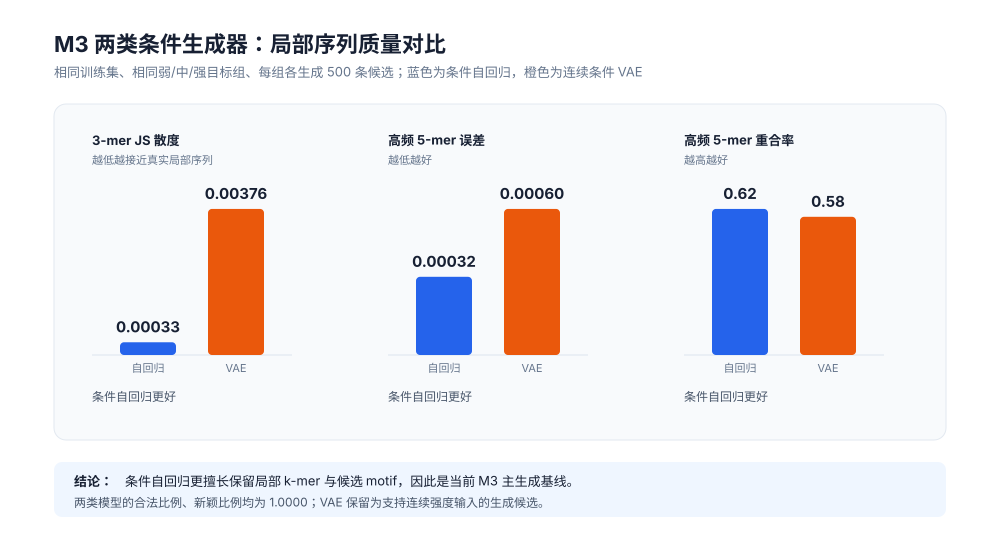
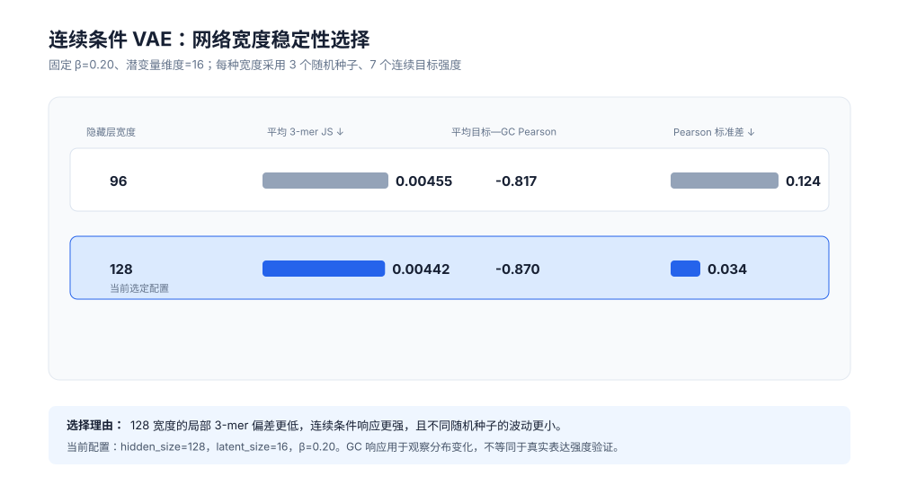

# M3 期中汇报图表说明

本轮从已经冻结的 M3 结果文件生成两张 SVG 图，适合直接插入后续 PPT 或汇报文档。图表只呈现实验已支持的结论。

## 图 1：两种条件生成器的局部序列质量对比



建议讲法：条件自回归模型在 3-mer 和 5-mer 两项局部结构指标上更好，说明它能更好保留真实启动子中相邻碱基的搭配，因此被选为当前 M3 主生成基线。两种模型都生成合法、唯一且未直接复制训练集的序列。

## 图 2：连续条件 VAE 的网络宽度选择



建议讲法：VAE 选择 128 宽度不是因为训练损失最低，而是因为它在生成 3-mer 保真度、目标条件响应和跨随机种子稳定性之间的平衡更好。当前 VAE 的价值是支持连续强度输入；GC 响应仅说明生成序列分布会随条件改变，不能当作真实表达强度的实验验证。

## 图表来源与复现

```bash
python scripts/render_m3_midterm_figures.py
```

所有数字来自已冻结的 `m3_conditional_generator_comparison_selected.json` 与 `m3_vae_width_stability.json`，没有重新训练模型，也没有使用测试集进行选择。
